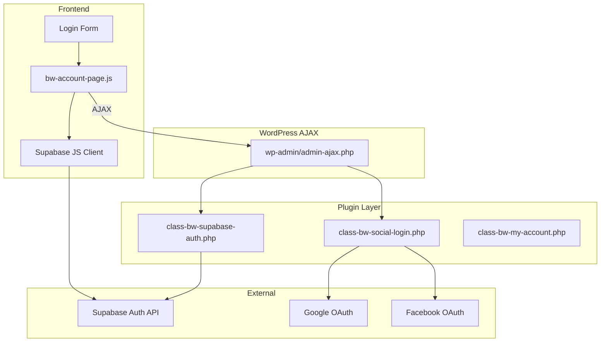
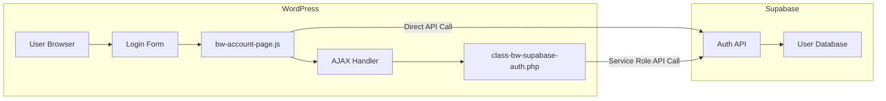
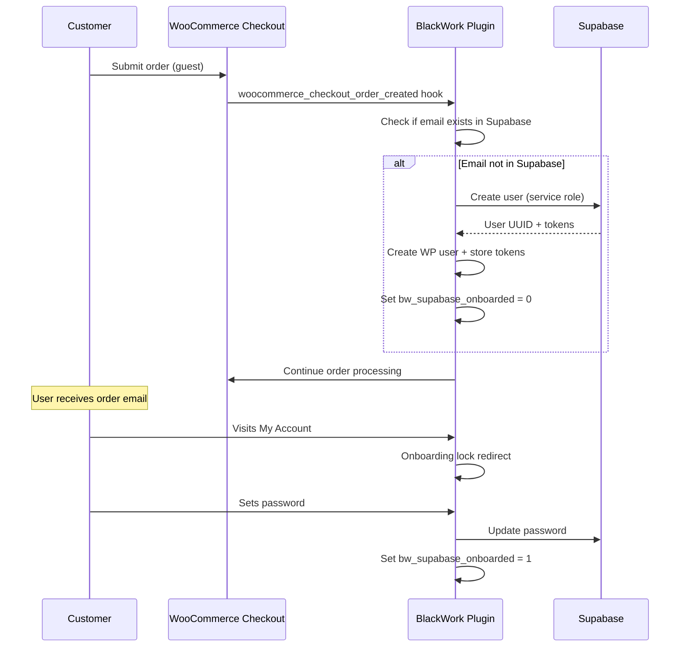
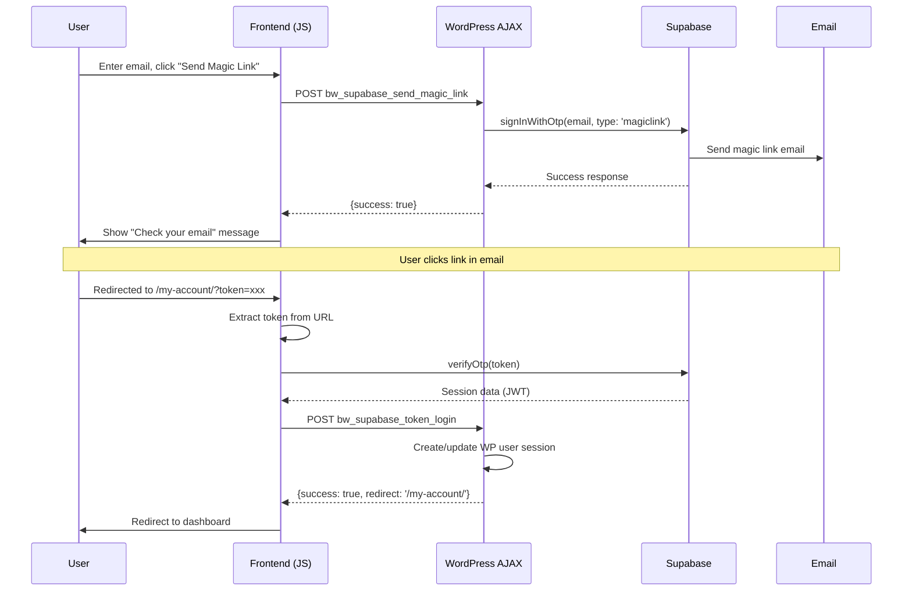
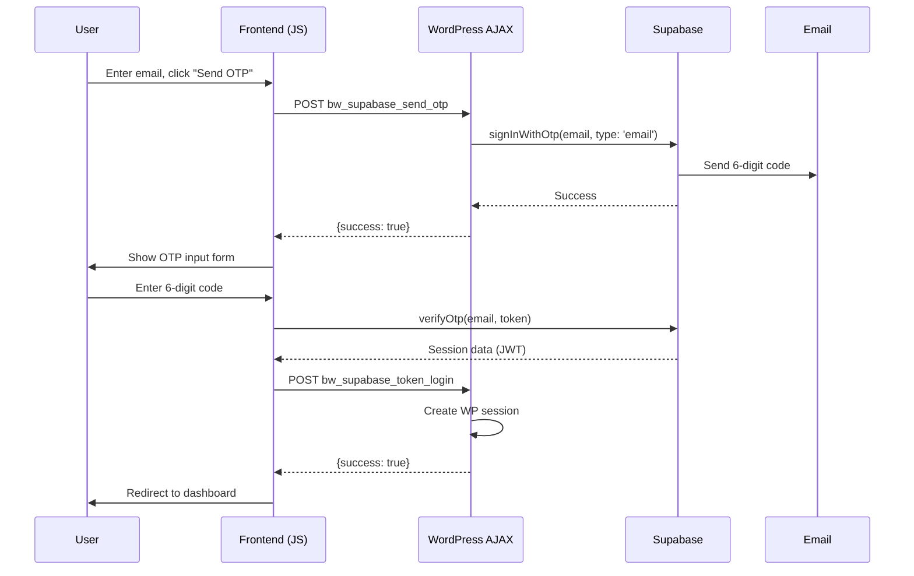
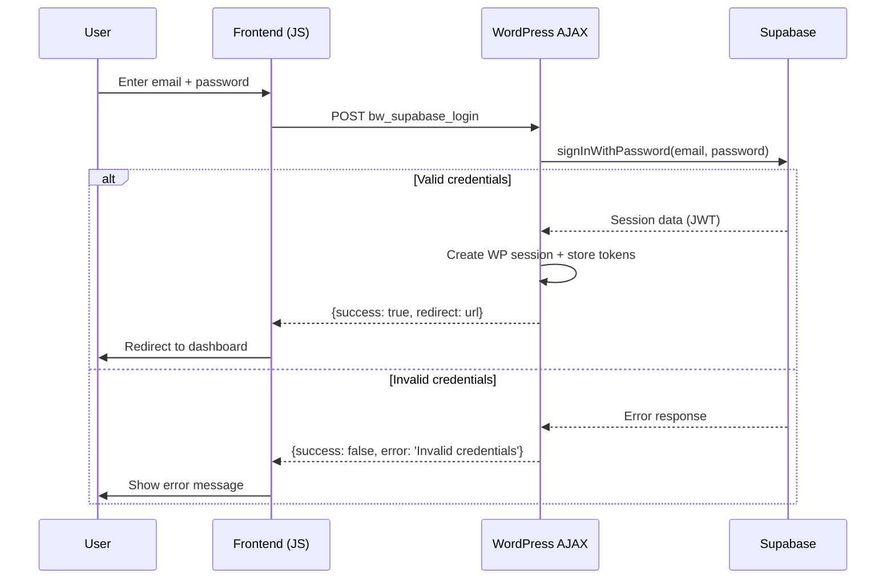
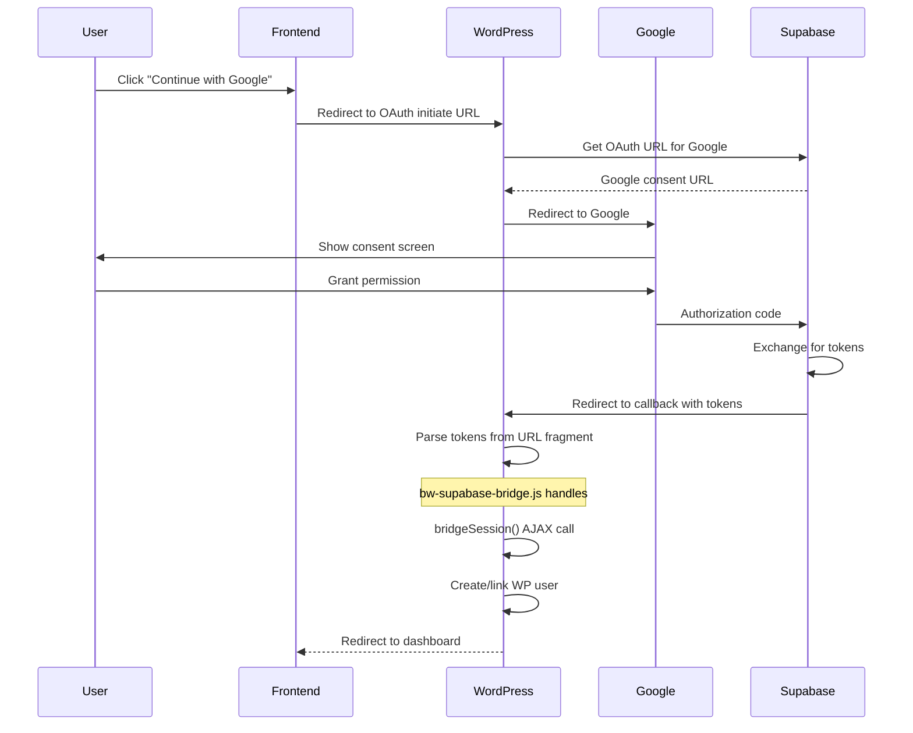
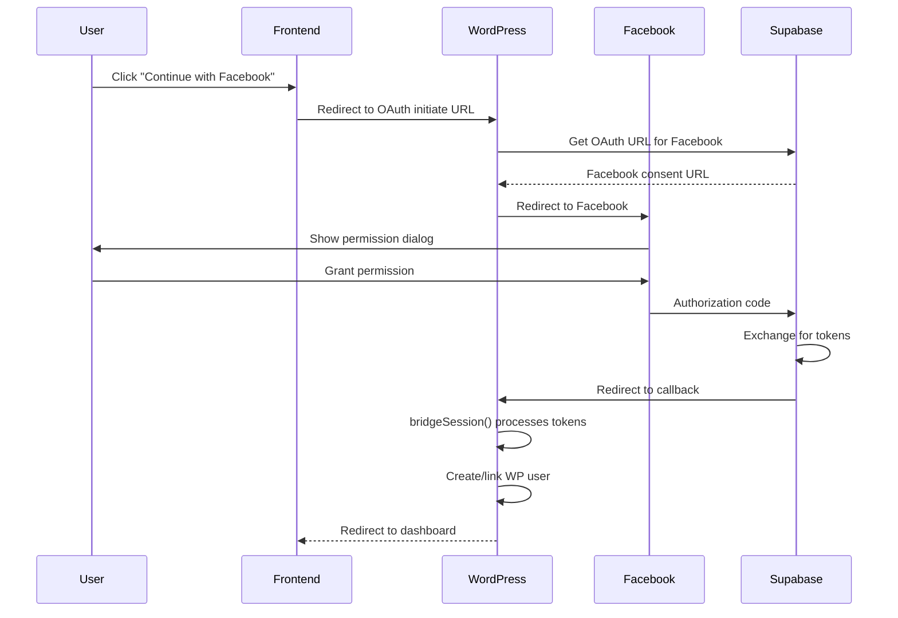
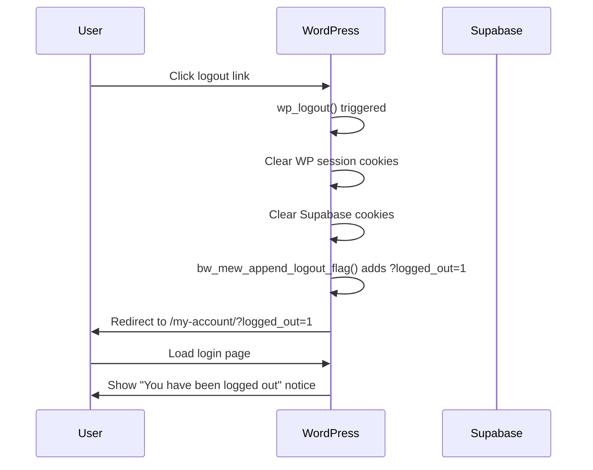

# RM — Retest + Reference Manual

> **BlackWork E-Commerce Plugin**
> Complete Technical Reference & Retest Protocol
> Last Updated: 2026-01-31

---

## Table of Contents

1. [Executive Overview](#1-executive-overview)
2. [Repository Architecture Map](#2-repository-architecture-map)
3. [Runtime Configuration](#3-runtime-configuration)
4. [Supabase Integration Deep Dive](#4-supabase-integration-deep-dive)
5. [Authentication Flows](#5-authentication-flows)
6. [Checkout Integration](#6-checkout-integration)
7. [My Account Integration](#7-my-account-integration)
8. [Retest Protocol](#8-retest-protocol)
9. [Extension Guide](#9-extension-guide)
10. [Appendices](#10-appendices)

---

## 1. Executive Overview

### 1.1 Purpose

The BlackWork plugin (`wpblackwork`) extends WordPress/WooCommerce with:

- **Supabase-backed authentication** — Magic link, OTP, password, OAuth (Google, Facebook)
- **Custom product types** — Digital Assets, Homebook, Print
- **Custom checkout** — Two-column layout with Stripe UPE integration
- **Custom My Account** — Unified login/register flow with onboarding lock
- **Elementor widgets** — 15+ custom widgets for product display

### 1.2 Key Architectural Decisions

| Decision | Rationale | File Reference |
|----------|-----------|----------------|
| Dual auth storage (cookie + usermeta) | WordPress sessions + Supabase JWT for API calls | `class-bw-supabase-auth.php:1200-1250` |
| Guest provisioning at checkout | Frictionless purchase → password setup later | `class-bw-supabase-auth.php:700-800` |
| Onboarding lock | Force password setup before account access | `class-bw-my-account.php:118-137` |
| Template override priority | Plugin templates > Theme templates | `woocommerce-init.php:80-120` |

### 1.3 Technology Stack

```
┌─────────────────────────────────────────────────────────┐
│                    Frontend Layer                        │
│  ┌─────────────┐  ┌──────────────┐  ┌────────────────┐  │
│  │ Elementor   │  │ WooCommerce  │  │ Supabase JS    │  │
│  │ Widgets     │  │ Templates    │  │ Client         │  │
│  └─────────────┘  └──────────────┘  └────────────────┘  │
├─────────────────────────────────────────────────────────┤
│                    Plugin Layer                          │
│  ┌─────────────┐  ┌──────────────┐  ┌────────────────┐  │
│  │ Auth        │  │ Checkout     │  │ Product        │  │
│  │ Handlers    │  │ Customization│  │ Types          │  │
│  └─────────────┘  └──────────────┘  └────────────────┘  │
├─────────────────────────────────────────────────────────┤
│                    External Services                     │
│  ┌─────────────┐  ┌──────────────┐  ┌────────────────┐  │
│  │ Supabase    │  │ Stripe       │  │ Brevo          │  │
│  │ Auth + DB   │  │ Payments     │  │ Email          │  │
│  └─────────────┘  └──────────────┘  └────────────────┘  │
└─────────────────────────────────────────────────────────┘
```

---

## 2. Repository Architecture Map

### 2.1 Directory Structure

```
wpblackwork/
├── bw-main-elementor-widgets.php      # Main plugin entry point
├── admin/
│   └── class-blackwork-site-settings.php  # Unified settings page (6000+ lines)
├── assets/
│   ├── css/
│   │   ├── bw-account-page.css        # Login/register styles
│   │   ├── bw-checkout.css            # Checkout customization
│   │   └── bw-*.css                   # Widget-specific styles
│   └── js/
│       ├── bw-account-page.js         # Login handler (1367 lines)
│       ├── bw-supabase-bridge.js      # OAuth token bridge (387 lines)
│       └── bw-*.js                    # Widget-specific scripts
├── includes/
│   ├── class-bw-widget-loader.php     # Auto-discovers widgets
│   ├── widgets/                       # 15+ Elementor widgets
│   ├── woocommerce-overrides/
│   │   ├── class-bw-supabase-auth.php     # Core auth (1479 lines)
│   │   ├── class-bw-social-login.php      # WP-native OAuth (548 lines)
│   │   ├── class-bw-my-account.php        # Account customization (421 lines)
│   │   └── class-bw-product-card-renderer.php
│   └── product-types/                 # Custom product types
├── woocommerce/
│   ├── woocommerce-init.php           # WC hooks & overrides (1558 lines)
│   └── templates/
│       ├── myaccount/                 # Account templates
│       ├── checkout/                  # Checkout templates
│       └── single-product/            # Product templates
├── cart-popup/                        # Side-sliding cart submodule
└── BW_coming_soon/                    # Coming soon submodule
```

### 2.2 Core File Responsibility Matrix

| File | Primary Responsibility | Lines | Key Functions |
|------|----------------------|-------|---------------|
| `class-bw-supabase-auth.php` | All Supabase authentication | 1479 | `bw_mew_handle_supabase_login()`, `bw_mew_supabase_store_session()` |
| `class-bw-social-login.php` | WordPress-native OAuth | 548 | `bw_mew_handle_oauth_callback()`, `bw_mew_initiate_oauth()` |
| `class-bw-my-account.php` | Account page customization | 421 | `bw_mew_enforce_supabase_onboarding_lock()` |
| `woocommerce-init.php` | WC template overrides | 1558 | `bw_mew_locate_template()`, asset enqueue |
| `class-blackwork-site-settings.php` | Admin settings UI | 6000+ | All option registration |
| `bw-account-page.js` | Frontend login logic | 1367 | `handleMagicLinkSubmit()`, `handleOtpVerify()` |
| `bw-supabase-bridge.js` | OAuth callback handler | 387 | `bridgeSession()`, token extraction |

### 2.3 Component Interaction Diagram



---

## 3. Runtime Configuration

### 3.1 WordPress Options (wp_options)

All settings are managed via `Blackwork > Site Settings` admin page.

#### 3.1.1 Supabase Configuration

| Option Key | Type | Default | Description | File Reference |
|------------|------|---------|-------------|----------------|
| `bw_supabase_project_url` | string | `''` | Supabase project URL | `class-bw-supabase-auth.php:45` |
| `bw_supabase_anon_key` | string | `''` | Supabase anon/public key | `class-bw-supabase-auth.php:46` |
| `bw_supabase_service_role_key` | string | `''` | Service role key (server-side) | `class-bw-supabase-auth.php:47` |
| `bw_supabase_jwt_secret` | string | `''` | JWT secret for verification | `class-bw-supabase-auth.php:48` |
| `bw_supabase_debug_log` | bool | `0` | Enable debug logging | `class-bw-supabase-auth.php:49` |
| `bw_supabase_oauth_google` | bool | `0` | Enable Google OAuth | `class-bw-supabase-auth.php:50` |
| `bw_supabase_oauth_facebook` | bool | `0` | Enable Facebook OAuth | `class-bw-supabase-auth.php:51` |

#### 3.1.2 Checkout Configuration

| Option Key | Type | Default | Description |
|------------|------|---------|-------------|
| `bw_checkout_logo_id` | int | `0` | Checkout header logo attachment ID |
| `bw_checkout_header_bg` | string | `#ffffff` | Header background color |
| `bw_checkout_header_txt` | string | `#000000` | Header text color |
| `bw_checkout_legal_text` | string | `''` | Legal text below place order |
| `bw_checkout_legal_color` | string | `#666666` | Legal text color |

#### 3.1.3 My Account Configuration

| Option Key | Type | Default | Description |
|------------|------|---------|-------------|
| `bw_myaccount_black_box_text` | string | `'Your mockups...'` | Dashboard welcome text |
| `bw_account_title_text` | string | `''` | Login page title |
| `bw_account_subtitle_text` | string | `''` | Login page subtitle |
| `bw_account_banner_id` | int | `0` | Login page banner image |

### 3.2 User Meta Keys

| Meta Key | Type | Description | Set By |
|----------|------|-------------|--------|
| `bw_supabase_user_id` | string | Supabase user UUID | `bw_mew_supabase_store_session()` |
| `bw_supabase_access_token` | string | JWT access token | `bw_mew_supabase_store_session()` |
| `bw_supabase_refresh_token` | string | Refresh token | `bw_mew_supabase_store_session()` |
| `bw_supabase_token_expires` | int | Token expiry timestamp | `bw_mew_supabase_store_session()` |
| `bw_supabase_onboarded` | int | 1 = completed onboarding | `bw_mew_handle_supabase_password_update()` |

### 3.3 Cookies

| Cookie Name | Purpose | Duration |
|-------------|---------|----------|
| `bw_supabase_access_token` | Supabase JWT for API calls | Session |
| `bw_supabase_refresh_token` | Token refresh capability | 30 days |

### 3.4 Configuration Retrieval Function

```php
// File: includes/woocommerce-overrides/class-bw-supabase-auth.php:30-60
function bw_mew_get_supabase_config() {
    return [
        'project_url'      => get_option( 'bw_supabase_project_url', '' ),
        'anon_key'         => get_option( 'bw_supabase_anon_key', '' ),
        'service_role_key' => get_option( 'bw_supabase_service_role_key', '' ),
        'jwt_secret'       => get_option( 'bw_supabase_jwt_secret', '' ),
        'debug'            => (bool) get_option( 'bw_supabase_debug_log', 0 ),
        'oauth_google'     => (bool) get_option( 'bw_supabase_oauth_google', 0 ),
        'oauth_facebook'   => (bool) get_option( 'bw_supabase_oauth_facebook', 0 ),
    ];
}
```

---

## 4. Supabase Integration Deep Dive

### 4.1 Architecture Overview



### 4.2 Dual-Path Authentication

The plugin supports two authentication paths:

1. **Frontend-initiated** (Magic Link, OTP, OAuth)
   - Supabase JS client handles auth directly
   - Token returned to browser
   - `bridgeSession()` sends token to WordPress via AJAX
   - WordPress creates/updates user session

2. **Backend-initiated** (Guest provisioning)
   - WordPress creates Supabase user via service role key
   - Stores tokens in usermeta
   - User completes onboarding later

### 4.3 Token Storage Strategy

```php
// File: class-bw-supabase-auth.php:1200-1280
function bw_mew_supabase_store_session( $user_id, $session_data ) {
    // Store in usermeta (persistent)
    update_user_meta( $user_id, 'bw_supabase_user_id', $session_data['user']['id'] );
    update_user_meta( $user_id, 'bw_supabase_access_token', $session_data['access_token'] );
    update_user_meta( $user_id, 'bw_supabase_refresh_token', $session_data['refresh_token'] );
    update_user_meta( $user_id, 'bw_supabase_token_expires', time() + $session_data['expires_in'] );

    // Store in cookies (for API calls)
    $secure = is_ssl();
    setcookie( 'bw_supabase_access_token', $session_data['access_token'], [
        'expires'  => time() + $session_data['expires_in'],
        'path'     => '/',
        'secure'   => $secure,
        'httponly' => true,
        'samesite' => 'Lax',
    ]);
}
```

### 4.4 AJAX Endpoints

| Action | Handler Function | File:Line | Purpose |
|--------|-----------------|-----------|---------|
| `bw_supabase_login` | `bw_mew_handle_supabase_login()` | `class-bw-supabase-auth.php:150` | Password login |
| `bw_supabase_token_login` | `bw_mew_handle_supabase_token_login()` | `class-bw-supabase-auth.php:250` | Token bridge from JS |
| `bw_supabase_check_email` | `bw_mew_handle_supabase_check_email()` | `class-bw-supabase-auth.php:350` | Email existence check |
| `bw_supabase_update_profile` | `bw_mew_handle_supabase_update_profile()` | `class-bw-supabase-auth.php:450` | Profile update |
| `bw_supabase_update_password` | `bw_mew_handle_supabase_password_update()` | `class-bw-supabase-auth.php:550` | Password change |
| `bw_supabase_send_magic_link` | `bw_mew_handle_magic_link()` | `class-bw-supabase-auth.php:650` | Magic link email |
| `bw_supabase_send_otp` | `bw_mew_handle_otp_send()` | `class-bw-supabase-auth.php:750` | OTP email |
| `bw_supabase_verify_otp` | `bw_mew_handle_otp_verify()` | `class-bw-supabase-auth.php:850` | OTP verification |

### 4.5 Guest Provisioning Flow



---

## 5. Authentication Flows

### 5.1 Magic Link Flow



**Code Reference:** `assets/js/bw-account-page.js:400-480`

### 5.2 OTP (One-Time Password) Flow



**Code Reference:** `assets/js/bw-account-page.js:500-580`

### 5.3 Password Login Flow



**Code Reference:** `class-bw-supabase-auth.php:150-240`

### 5.4 Google OAuth Flow



**Code Reference:**
- Initiation: `class-bw-social-login.php:100-150`
- Callback: `assets/js/bw-supabase-bridge.js:50-150`

### 5.5 Facebook OAuth Flow



**Code Reference:** `class-bw-social-login.php:150-200`

### 5.6 Logout Flow



**Code Reference:** `class-bw-my-account.php:53-68`

---

## 6. Checkout Integration

### 6.1 Two-Column Layout

The checkout uses a custom two-column layout:

```
┌─────────────────────────────────────────────────────────┐
│                    Checkout Header                       │
│  [Logo]                              [Back to Cart]     │
├─────────────────────────┬───────────────────────────────┤
│                         │                               │
│   Billing Details       │       Order Summary           │
│   - Contact info        │       - Product list          │
│   - Address fields      │       - Subtotal              │
│                         │       - Shipping              │
│   Shipping Details      │       - Tax                   │
│   (if different)        │       - Total                 │
│                         │                               │
│   Payment Methods       │       [Place Order Button]    │
│   - Stripe UPE          │                               │
│   - PayPal (optional)   │       Legal Text              │
│                         │                               │
└─────────────────────────┴───────────────────────────────┘
```

**Template:** `woocommerce/templates/checkout/form-checkout.php`

### 6.2 Stripe UPE Integration

```php
// File: woocommerce/woocommerce-init.php:800-850
add_filter( 'wc_stripe_upe_params', 'bw_mew_customize_stripe_upe' );
function bw_mew_customize_stripe_upe( $params ) {
    $params['appearance'] = [
        'theme'     => 'stripe',
        'variables' => [
            'colorPrimary'   => get_option( 'bw_stripe_accent_color', '#000000' ),
            'borderRadius'   => '4px',
            'fontFamily'     => 'system-ui, sans-serif',
        ],
    ];
    return $params;
}
```

### 6.3 Guest Provisioning at Checkout

When a guest completes checkout:

1. **Order created hook fires** (`woocommerce_checkout_order_created`)
2. **Email check** — Does email exist in WordPress?
3. **Supabase check** — Does email exist in Supabase?
4. **Create accounts** — Create both if needed
5. **Link accounts** — Store Supabase UUID in usermeta
6. **Set onboarding flag** — `bw_supabase_onboarded = 0`
7. **Continue checkout** — Order processing continues normally

```php
// File: class-bw-supabase-auth.php:700-800
add_action( 'woocommerce_checkout_order_created', 'bw_mew_provision_guest_user', 10, 2 );
function bw_mew_provision_guest_user( $order, $data ) {
    $email = $order->get_billing_email();

    // Check if already a user
    $existing_user = get_user_by( 'email', $email );
    if ( $existing_user ) {
        return; // Already has account
    }

    // Create Supabase user
    $config = bw_mew_get_supabase_config();
    $response = wp_remote_post( $config['project_url'] . '/auth/v1/admin/users', [
        'headers' => [
            'Authorization' => 'Bearer ' . $config['service_role_key'],
            'Content-Type'  => 'application/json',
        ],
        'body' => json_encode([
            'email'          => $email,
            'email_confirm'  => true,
            'user_metadata'  => [
                'first_name' => $order->get_billing_first_name(),
                'last_name'  => $order->get_billing_last_name(),
            ],
        ]),
    ]);

    // Create WordPress user and link
    // ... (see full implementation in file)
}
```

---

## 7. My Account Integration

### 7.1 Page States

The My Account page has distinct states:

| State | Condition | Display |
|-------|-----------|---------|
| Logged Out | `!is_user_logged_in()` | Login/Register form |
| Onboarding Lock | `bw_user_needs_onboarding()` | Set password form only |
| Logged In | `is_user_logged_in() && onboarded` | Full dashboard |

### 7.2 Menu Items

```php
// File: class-bw-my-account.php:17-41
function bw_mew_filter_account_menu_items( $items ) {
    $order = [ 'dashboard', 'downloads', 'orders', 'edit-account', 'customer-logout' ];
    $filtered_items = [];

    foreach ( $order as $endpoint ) {
        if ( 'orders' === $endpoint ) {
            $label = __( 'My purchases', 'bw' );
        } else {
            $label = $items[ $endpoint ] ?? '';
            // Custom labels...
        }
        $filtered_items[ $endpoint ] = $label;
    }

    return $filtered_items;
}
```

### 7.3 Onboarding Lock Mechanism

```php
// File: class-bw-my-account.php:118-137
function bw_mew_enforce_supabase_onboarding_lock() {
    if ( ! is_account_page() || ! is_user_logged_in() ) {
        return;
    }

    // User completed onboarding?
    if ( ! bw_user_needs_onboarding( get_current_user_id() ) ) {
        // Redirect away from set-password if already done
        if ( is_wc_endpoint_url( 'set-password' ) ) {
            wp_safe_redirect( wc_get_page_permalink( 'myaccount' ) );
            exit;
        }
        return;
    }

    // Allow logout and set-password endpoints only
    if ( is_wc_endpoint_url( 'set-password' ) || is_wc_endpoint_url( 'customer-logout' ) ) {
        return;
    }

    // Force to set-password
    wp_safe_redirect( wc_get_account_endpoint_url( 'set-password' ) );
    exit;
}
```

### 7.4 Login Form Screens

The login form uses JavaScript to switch between screens:

| Screen | Trigger | Elements |
|--------|---------|----------|
| `magic` | Default / "Back" button | Email input + "Send Magic Link" |
| `otp` | After magic link sent | OTP input + "Verify" |
| `password` | "Use password" link | Email + Password inputs |
| `register` | "Register" tab | Registration form |

```javascript
// File: assets/js/bw-account-page.js:100-150
function switchAuthScreen(screen) {
    const screens = document.querySelectorAll('[data-auth-screen]');
    screens.forEach(s => s.classList.remove('active'));

    const target = document.querySelector(`[data-auth-screen="${screen}"]`);
    if (target) {
        target.classList.add('active');
        // Fade animation
        target.style.opacity = 0;
        setTimeout(() => target.style.opacity = 1, 50);
    }
}
```

---

## 8. Retest Protocol

### 8.1 Prerequisites

Before testing, ensure:

1. **Supabase project configured**
   - Project URL and anon key set in settings
   - Service role key set for guest provisioning
   - OAuth providers configured in Supabase dashboard

2. **WordPress environment**
   - WooCommerce active with products
   - Checkout page set
   - My Account page set

3. **Test accounts ready**
   - Fresh email addresses for testing
   - Access to email inbox

### 8.2 Test Matrix

| ID | Test Case | Steps | Expected Result | Priority |
|----|-----------|-------|-----------------|----------|
| **AUTH-001** | Magic Link Login | 1. Go to /my-account<br>2. Enter valid email<br>3. Click "Send Magic Link"<br>4. Click link in email | Logged in, redirected to dashboard | High |
| **AUTH-002** | OTP Login | 1. Go to /my-account<br>2. Enter email<br>3. Click "Send OTP"<br>4. Enter 6-digit code | Logged in, redirected to dashboard | High |
| **AUTH-003** | Password Login | 1. Go to /my-account<br>2. Switch to password mode<br>3. Enter email + password<br>4. Click Login | Logged in if credentials valid | High |
| **AUTH-004** | Google OAuth | 1. Go to /my-account<br>2. Click "Continue with Google"<br>3. Complete Google consent | Logged in, account linked | High |
| **AUTH-005** | Facebook OAuth | 1. Go to /my-account<br>2. Click "Continue with Facebook"<br>3. Complete FB consent | Logged in, account linked | High |
| **AUTH-006** | Logout | 1. While logged in, click Logout | Logged out, redirected to login with notice | High |
| **AUTH-007** | Onboarding Lock | 1. Complete guest checkout<br>2. Go to /my-account | Forced to set-password page | High |
| **AUTH-008** | Set Password | 1. On set-password page<br>2. Enter new password<br>3. Confirm password<br>4. Submit | Password set, redirected to dashboard | High |
| **CHK-001** | Guest Checkout | 1. Add product to cart<br>2. Go to checkout<br>3. Complete as guest | Order created, WP user created, Supabase user created | High |
| **CHK-002** | Logged-in Checkout | 1. Login<br>2. Add product<br>3. Complete checkout | Order linked to existing user | Medium |
| **ACC-001** | View Orders | 1. Login<br>2. Go to My Purchases | Orders displayed | Medium |
| **ACC-002** | Edit Profile | 1. Login<br>2. Go to Settings<br>3. Update name<br>4. Save | Profile updated | Medium |
| **ACC-003** | View Downloads | 1. Login<br>2. Go to Downloads | Available downloads shown | Medium |

### 8.3 Error Scenarios

| ID | Scenario | Steps | Expected Behavior |
|----|----------|-------|-------------------|
| **ERR-001** | Invalid password | Enter wrong password | "Invalid credentials" error shown |
| **ERR-002** | Expired magic link | Click old magic link | Error message, option to request new |
| **ERR-003** | Invalid OTP | Enter wrong OTP code | "Invalid code" error, can retry |
| **ERR-004** | Network failure | Disable network during login | Error message, retry option |
| **ERR-005** | Rate limiting | Rapid login attempts | Rate limit message after 20 attempts |

### 8.4 Debug Logging

Enable debug mode for troubleshooting:

1. **Enable in settings:** Blackwork > Site Settings > Account Page > Technical Settings > Debug Log
2. **View logs:** `wp-content/debug.log`
3. **Log format:** `[BW Supabase] action_name: details`

```php
// Example log entries
[BW Supabase] login_attempt: email=user@example.com
[BW Supabase] login_success: wp_user_id=123, supabase_id=abc-def-ghi
[BW Supabase] token_stored: user_id=123, expires=1706745600
```

---

## 9. Extension Guide

### 9.1 Adding a New Authentication Method

To add a new auth method (e.g., SMS OTP):

1. **Add AJAX handler:**

```php
// File: class-bw-supabase-auth.php
add_action( 'wp_ajax_nopriv_bw_supabase_sms_login', 'bw_mew_handle_sms_login' );
add_action( 'wp_ajax_bw_supabase_sms_login', 'bw_mew_handle_sms_login' );

function bw_mew_handle_sms_login() {
    check_ajax_referer( 'bw-supabase-login', 'nonce' );

    $phone = sanitize_text_field( $_POST['phone'] ?? '' );
    if ( empty( $phone ) ) {
        wp_send_json_error( [ 'message' => 'Phone required' ] );
    }

    // Call Supabase SMS OTP API
    $config = bw_mew_get_supabase_config();
    $response = wp_remote_post( $config['project_url'] . '/auth/v1/otp', [
        'headers' => [
            'apikey' => $config['anon_key'],
            'Content-Type' => 'application/json',
        ],
        'body' => json_encode([
            'phone' => $phone,
        ]),
    ]);

    // Handle response...
}
```

2. **Add frontend handler:**

```javascript
// File: assets/js/bw-account-page.js
async function handleSmsLogin(phone) {
    const response = await fetch(bwAccountSettings.ajaxUrl, {
        method: 'POST',
        headers: { 'Content-Type': 'application/x-www-form-urlencoded' },
        body: new URLSearchParams({
            action: 'bw_supabase_sms_login',
            nonce: bwAccountSettings.nonce,
            phone: phone,
        }),
    });

    const data = await response.json();
    if (data.success) {
        switchAuthScreen('sms-verify');
    } else {
        showError(data.data.message);
    }
}
```

3. **Add UI elements:**

```php
// File: woocommerce/templates/myaccount/form-login.php
<div data-auth-screen="sms">
    <input type="tel" name="phone" placeholder="Phone number">
    <button type="button" onclick="handleSmsLogin(this.form.phone.value)">
        Send SMS Code
    </button>
</div>
```

### 9.2 Adding Custom Account Endpoints

```php
// 1. Register endpoint
add_action( 'init', function() {
    add_rewrite_endpoint( 'my-custom-page', EP_ROOT | EP_PAGES );
});

// 2. Add to WC query vars
add_filter( 'woocommerce_get_query_vars', function( $vars ) {
    $vars['my-custom-page'] = 'my-custom-page';
    return $vars;
});

// 3. Add to menu (optional)
add_filter( 'woocommerce_account_menu_items', function( $items ) {
    $items['my-custom-page'] = 'My Custom Page';
    return $items;
});

// 4. Render content
add_action( 'woocommerce_account_my-custom-page_endpoint', function() {
    echo '<h2>Custom Page Content</h2>';
});
```

### 9.3 Hooking into Authentication Events

```php
// After successful login
add_action( 'bw_supabase_login_success', function( $wp_user_id, $supabase_user_id ) {
    // Custom logic after login
    update_user_meta( $wp_user_id, 'last_login', current_time( 'mysql' ) );
}, 10, 2 );

// After guest provisioning
add_action( 'bw_supabase_guest_provisioned', function( $wp_user_id, $order_id ) {
    // Send welcome email, etc.
}, 10, 2 );

// Before logout
add_action( 'bw_supabase_before_logout', function( $wp_user_id ) {
    // Cleanup tasks
});
```

---

## 10. Appendices

### 10.1 Glossary

| Term | Definition |
|------|------------|
| **Anon Key** | Supabase public API key, safe to expose in frontend |
| **Service Role Key** | Supabase admin key with elevated privileges, server-side only |
| **JWT** | JSON Web Token, used for authentication state |
| **Magic Link** | Passwordless login via email link |
| **OTP** | One-Time Password, 6-digit code sent via email |
| **Onboarding Lock** | Mechanism forcing users to set password before accessing account |
| **Guest Provisioning** | Automatic account creation during guest checkout |
| **Token Bridge** | AJAX mechanism to transfer Supabase tokens from JS to WordPress |
| **UPE** | Universal Payment Element (Stripe's unified payment UI) |

### 10.2 Option Keys Reference

#### Supabase Settings
```
bw_supabase_project_url          - Supabase project URL
bw_supabase_anon_key             - Public API key
bw_supabase_service_role_key     - Admin API key
bw_supabase_jwt_secret           - JWT verification secret
bw_supabase_debug_log            - Enable debug logging (0/1)
bw_supabase_oauth_google         - Enable Google OAuth (0/1)
bw_supabase_oauth_facebook       - Enable Facebook OAuth (0/1)
```

#### Checkout Settings
```
bw_checkout_logo_id              - Header logo attachment ID
bw_checkout_header_bg            - Header background color
bw_checkout_header_txt           - Header text color
bw_checkout_legal_text           - Legal text content
bw_checkout_legal_color          - Legal text color
```

#### Account Page Settings
```
bw_myaccount_black_box_text      - Dashboard welcome text
bw_account_title_text            - Login page title
bw_account_subtitle_text         - Login page subtitle
bw_account_banner_id             - Login page banner image
bw_account_form_bg               - Form background color
bw_account_form_txt              - Form text color
```

### 10.3 AJAX Actions Reference

| Action | Auth Required | Nonce | Handler |
|--------|---------------|-------|---------|
| `bw_supabase_login` | No | `bw-supabase-login` | Password login |
| `bw_supabase_token_login` | No | `bw-supabase-login` | Token bridge |
| `bw_supabase_check_email` | No | `bw-supabase-login` | Email check |
| `bw_supabase_send_magic_link` | No | `bw-supabase-login` | Magic link |
| `bw_supabase_send_otp` | No | `bw-supabase-login` | Send OTP |
| `bw_supabase_verify_otp` | No | `bw-supabase-login` | Verify OTP |
| `bw_supabase_update_profile` | Yes | `bw-supabase-login` | Update profile |
| `bw_supabase_update_password` | Yes | `bw-supabase-login` | Change password |

### 10.4 File Quick Reference

| Purpose | File Path |
|---------|-----------|
| Main plugin entry | `bw-main-elementor-widgets.php` |
| Admin settings | `admin/class-blackwork-site-settings.php` |
| Supabase auth | `includes/woocommerce-overrides/class-bw-supabase-auth.php` |
| Social login | `includes/woocommerce-overrides/class-bw-social-login.php` |
| Account logic | `includes/woocommerce-overrides/class-bw-my-account.php` |
| WC overrides | `woocommerce/woocommerce-init.php` |
| Login template | `woocommerce/templates/myaccount/form-login.php` |
| Set password | `woocommerce/templates/myaccount/set-password.php` |
| Dashboard | `woocommerce/templates/myaccount/dashboard.php` |
| Account JS | `assets/js/bw-account-page.js` |
| OAuth bridge | `assets/js/bw-supabase-bridge.js` |
| Account CSS | `assets/css/bw-account-page.css` |

### 10.5 Security Considerations

1. **Nonce Verification:** All AJAX handlers verify WordPress nonces
2. **Rate Limiting:** OAuth attempts limited to 20/hour per IP
3. **Service Role Key:** Never exposed to frontend, server-side only
4. **JWT Storage:** Tokens stored in httponly cookies when possible
5. **Password Hashing:** Passwords never stored in WordPress, only in Supabase
6. **Input Sanitization:** All user input sanitized via `sanitize_*()` functions
7. **HTTPS Required:** Cookies marked secure when SSL enabled

### 10.6 Troubleshooting

| Issue | Possible Cause | Solution |
|-------|---------------|----------|
| Magic link not received | Email in spam, Supabase rate limit | Check spam folder, wait and retry |
| OAuth redirect fails | Incorrect callback URL | Verify callback URL in Supabase dashboard |
| Token bridge fails | Nonce expired, AJAX error | Refresh page, check browser console |
| Onboarding lock stuck | Meta not updated | Check `bw_supabase_onboarded` usermeta |
| Guest not provisioned | Service role key missing | Add service role key in settings |
| Login redirects to wrong page | WC myaccount page misconfigured | Verify WooCommerce pages settings |

---

*Document generated from codebase analysis. All file references are relative to `/wp-content/plugins/wpblackwork/`.*
