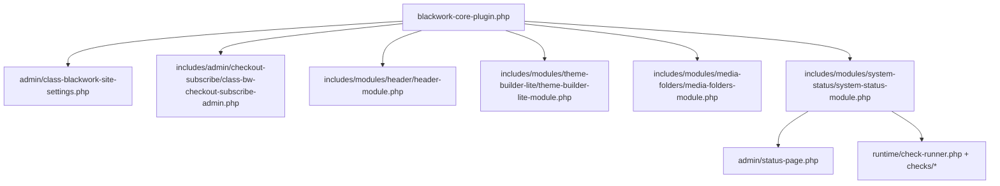

# BW-TASK-20260305-08 Admin Panel Architecture Audit

## Scope
Audit target: Blackwork Site admin panel after Shopify-style UI rollout.

Audited domains:
- code cleanliness
- performance (admin-only)
- security (admin-only)
- maintainability
- file/module organization

## Inventory (Authoritative)

### Admin surfaces (Blackwork Site panel)
| Surface | Slug / Route | Entrypoint | Module/Owner | Save model | UI shell |
|---|---|---|---|---|---|
| Site Settings | `admin.php?page=blackwork-site-settings` | `bw_site_settings_page()` in `admin/class-blackwork-site-settings.php` | Core admin router | Custom POST + nonce per tab | `.bw-admin-root` |
| Status | `admin.php?page=bw-system-status` | `bw_system_status_render_admin_page()` in `includes/modules/system-status/admin/status-page.php` | System Status module | AJAX-only (`bw_system_status_run_check`) | `.bw-admin-root` |
| Media Folders (settings) | `admin.php?page=bw-media-folders-settings` | `bw_mf_render_settings_page()` in `includes/modules/media-folders/admin/media-folders-settings.php` | Media Folders module | Custom POST + nonce | `.bw-admin-root` |
| Mail Marketing | `admin.php?page=blackwork-mail-marketing` | `render_mail_marketing_page()` in `includes/admin/checkout-subscribe/class-bw-checkout-subscribe-admin.php` | Checkout Subscribe admin | Custom POST + nonce | `.bw-admin-root` |
| Header | `admin.php?page=bw-header-settings` | `bw_header_render_admin_page()` in `includes/modules/header/admin/header-admin.php` | Header module | Settings API (`options.php`) | `.bw-admin-root` |
| Theme Builder Lite | `admin.php?page=bw-theme-builder-lite-settings` | `bw_tbl_render_admin_page()` in `includes/modules/theme-builder-lite/admin/theme-builder-lite-admin.php` | Theme Builder Lite module | Settings API + module-specific import POST | `.bw-admin-root` |
| All Templates | `edit.php?post_type=bw_template` | WP_List_Table + UX wrapper in `includes/modules/theme-builder-lite/admin/bw-template-type-inline.js` | Theme Builder Lite CPT list | WP-native list table actions + inline AJAX type update | `.bw-admin-root` injected |

### Shared assets / wrappers
- Shared UI kit CSS: `admin/css/bw-admin-ui-kit.css`
- Shared UI kit enqueue guard: `bw_admin_enqueue_ui_kit_assets()` in `admin/class-blackwork-site-settings.php`
- Screen guard function: `bw_is_blackwork_site_admin_screen()`
- Shared wrapper contract: `.bw-admin-root` + `.bw-admin-header` + `.bw-admin-action-bar` + `.bw-admin-card`

### Module loading chain

## Findings

### Security
Strengths:
- Admin pages are capability-gated (`manage_options` or stricter contextual caps).
- Admin POST actions use nonce verification across panel save flows.
- Admin AJAX endpoints for Status / Mail Marketing / Media Folders / Theme Builder inline type use nonce + capability checks.
- Status checks are read-only by contract and implementation.

Risks:
1. Inconsistent input hardening style on some admin entrypoints (mixed direct `$_GET` usage vs `sanitize_key/wp_unslash`).
   - Risk level: Low
   - Impact: Mostly hygiene/consistency; can increase review burden and accidental drift.
2. Diagnostics endpoint payload includes infrastructure-adjacent metadata (table names/sizes, environment flags).
   - Risk level: Medium (already tracked under `R-ADM-18`)
   - Impact: acceptable for privileged admins, but keep strict capability boundary.

### Performance
Strengths:
- Status diagnostics run on-demand only and use transient snapshots (`bw_system_status_snapshot_v1`, 10 min TTL).
- Expensive scans are bounded (media/image-size count caps) with partial warnings.
- Module assets generally use screen/page guards.

Risks:
1. Broad enqueue in `bw_site_settings_admin_assets()`:
   - loads color-picker/media + payment test scripts across all Blackwork admin screens, including `edit.php?post_type=bw_template`.
   - Risk level: Medium (admin responsiveness)
2. Media Folders folder-count endpoint does per-term counting queries (`bw_mf_get_folder_counts_map()` loop).
   - Risk level: Medium on large term sets/media libraries.
3. Status page has large inline style block in renderer instead of shared/static styling.
   - Risk level: Low-Medium (cache inefficiency + drift from UI kit).

### Maintainability / Cleanliness
Strengths:
- Shared UI kit now exists and is centrally enqueued.
- All target pages migrated to the same visual shell.
- Module boundaries are mostly coherent under `includes/modules/*`.

Risks:
1. `admin/class-blackwork-site-settings.php` remains a high-complexity monolith (routing, saves, AJAX, import workflows).
   - Risk level: High (change risk + review cost)
2. Repeated page-shell markup patterns across modules are hand-authored (header/action-bar/cards/tabs), no PHP helper abstraction.
   - Risk level: Medium
3. Status page still carries custom page-local CSS instead of relying on reusable kit primitives.
   - Risk level: Medium (future divergence).

## Prioritized Refactor Roadmap

### P0 (security correctness)
1. Standardize admin input hardening contract.
- Scope: normalize `$_GET`/`$_POST` access patterns in Blackwork admin entrypoints.
- Files: `admin/class-blackwork-site-settings.php`, `includes/modules/header/admin/header-admin.php`, selected module admin entrypoints.
- Risk: Low
- Regression surfaces: page routing/tab resolution.
- Commit split:
  - `refactor(admin): normalize admin request input sanitization in panel entrypoints`

### P1 (performance/enqueue correctness)
1. Narrow `bw_site_settings_admin_assets()` loading matrix by page/tab.
- Scope: load payment/redirect/color-picker/media assets only where needed.
- Files: `admin/class-blackwork-site-settings.php`
- Risk: Medium
- Regression surfaces: tab JS behavior, media upload controls, payment test buttons.
- Commit split:
  - `perf(admin): tighten blackwork site asset enqueue by page and tab`

2. Optimize Media Folders counts path.
- Scope: replace per-term count loop with batched aggregate strategy and/or short-lived cache.
- Files: `includes/modules/media-folders/runtime/ajax.php`
- Risk: Medium
- Regression surfaces: folder counts in tree/default buckets.
- Commit split:
  - `perf(media-folders): batch folder count aggregation for ajax payloads`

### P2 (maintainability/dedup)
1. Extract reusable admin page-shell helper (PHP renderer utility).
- Scope: helper for header/action-bar/card scaffolding; keep existing behavior intact.
- Files: `admin/` helper + module admin renderers.
- Risk: Medium
- Regression surfaces: visual parity + save button placement.
- Commit split:
  - `refactor(admin-ui): introduce reusable admin shell helpers for panel pages`

2. Status page styling consolidation into shared UI kit (or module css file).
- Scope: reduce inline style block; align with UI kit tokens/primitives.
- Files: `includes/modules/system-status/admin/status-page.php`, `admin/css/bw-admin-ui-kit.css`
- Risk: Low-Medium
- Regression surfaces: Status layout and responsive behavior.
- Commit split:
  - `refactor(status-ui): move inline admin styles to shared scoped primitives`

3. Propose ADR for admin router decomposition.
- Scope: split `class-blackwork-site-settings.php` into tab modules and dedicated handlers.
- Risk: High (structural)
- Requirement: ADR before implementation.

## Regression Checklist (for all refactor phases)
- [ ] Blackwork top-level menu lands on Site Settings.
- [ ] All migrated pages render with `.bw-admin-root`.
- [ ] UI kit styles do not bleed into non-Blackwork admin screens.
- [ ] Save flows unchanged (nonce, option keys, target handlers).
- [ ] Status checks remain read-only and run on-demand/cached only.
- [ ] All Templates WP list table behavior unchanged (search/filter/bulk/sort/pagination/row actions).
- [ ] No PHP notices/warnings/fatal errors on target screens.

## Task Output
- Runtime code changed: No
- Governance/docs sync: Yes (see linked updated docs)
